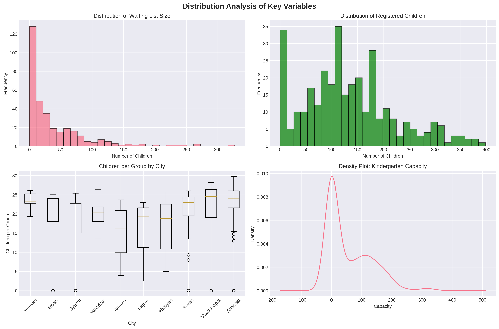
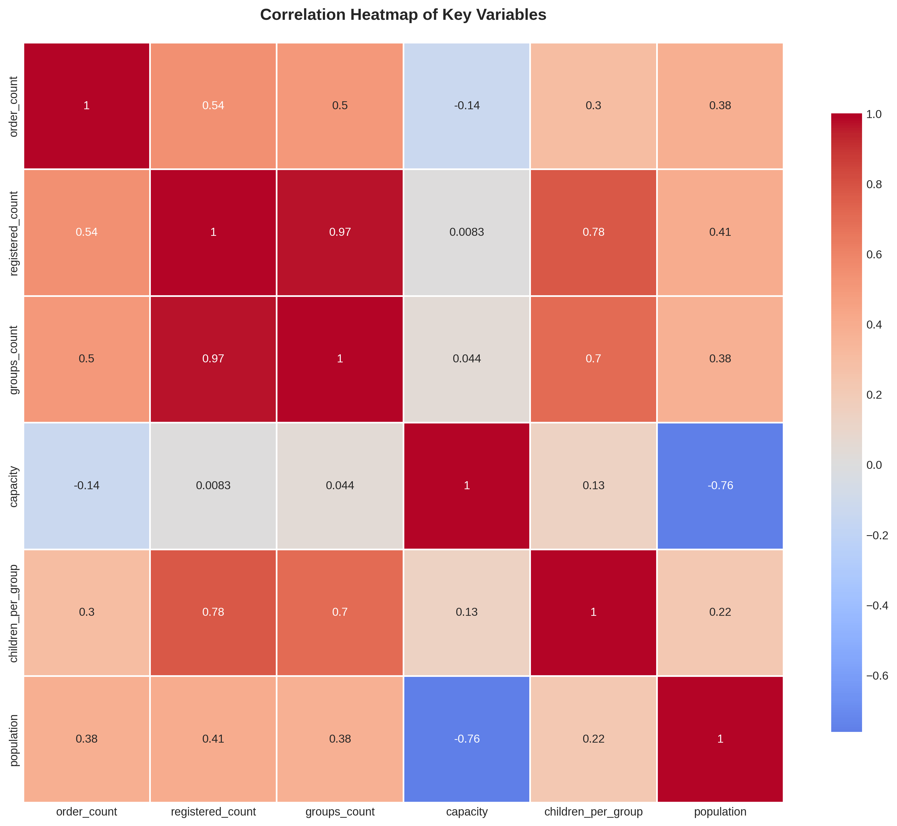
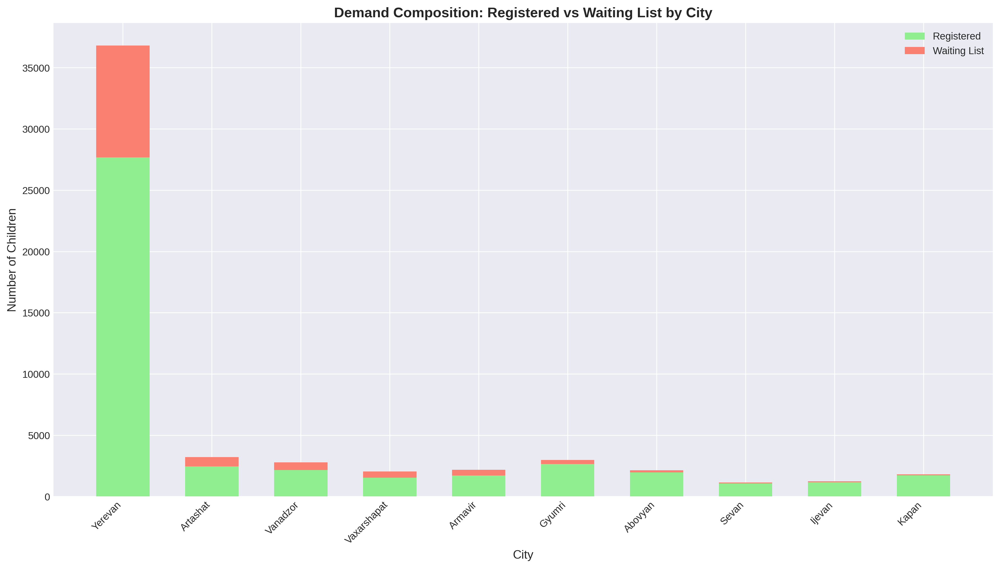

# 🏫 Armenian Kindergarten Multi-City Analysis

[](https://www.python.org/)
[](LICENSE)
[]()

> **Comprehensive data analysis of kindergarten infrastructure across 10 Armenian largest cities**

A data science project analyzing early childhood education demand, capacity, and accessibility patterns across Armenia through web scraping, statistical analysis, and visualization.

---

## 📋 Table of Contents

- [Overview](#overview)
- [Key Features](#key-features)
- [Dataset](#dataset)
- [Project Structure](#project-structure)
- [Installation](#installation)
- [Usage](#usage)
- [Methodology](#methodology)
- [Results](#results)
- [Visualizations](#visualizations)
- [Technologies](#technologies)
- [Contributing](#contributing)
- [Authors](#authors)
- [License](#license)
- [Acknowledgments](#acknowledgments)

---

## 🎯 Overview

This project collects and analyzes kindergarten data from **10 Armenian largest cities** to understand:

- 📊 Regional variations in demand and capacity
- 🏙️ Urban vs rural differences in educational infrastructure
- 📈 Statistical patterns across municipalities
- ⚖️ Demand-supply gaps and overcrowding issues
- 🎯 Data-driven insights for policy recommendations

### Problem Statement

Armenia faces challenges in early childhood education accessibility with varying levels of kindergarten availability across regions. This analysis quantifies these disparities and provides actionable insights.

---

## ✨ Key Features

- ✅ **Multi-source web scraping** - Automated data collection from 10 government websites
- ✅ **Comprehensive data cleaning** - Handling missing values, duplicates, and inconsistencies
- ✅ **Advanced preprocessing** - Feature engineering, scaling, encoding, dimensionality reduction
- ✅ **Statistical analysis** - ANOVA, t-tests, chi-square tests, correlation analysis
- ✅ **Professional visualizations** - 6+ high-quality charts and graphs
- ✅ **Reproducible pipeline** - Well-documented Jupyter notebook workflow
- ✅ **328 kindergartens analyzed** across 10 cities

---

## 📊 Dataset

### Data Sources

| City | Population | Region | Kindergartens |
|------|-----------|--------|---------------|
| Yerevan | 1,093,000 | Capital | 162 |
| Gyumri | 121,000 | Shirak | 24 |
| Vanadzor | 82,000 | Lori | 23 |
| Artashat | 29,040 | Ararat | 32 |
| Abovyan | 46,000 | Kotayk | 12 |
| Kapan | 43,000 | Syunik | 18 |
| Armavir | 29,000 | Armavir | 17 |
| Ijevan | 21,000 | Tavush | 16 |
| Sevan | 19,000 | Gegharkunik | 14 |
| Vaxarshapat | 47,446 | Armavir | 10 |

### Features

**11 Core Features:**
- City, name, district, address, phone
- Order count (waiting list), registered children
- Groups count, capacity, population, region

**16+ Engineered Features:**
- Waiting list ratio, demand rate, occupancy rate
- Children per group, capacity per group
- Per capita metrics (waiting/capacity per 100k)
- Binary indicators (overcrowded, full, has waiting list)
- Categorical bins (size, demand, city size)

---

## 📁 Project Structure
```
Armenian-Kindergarten-Analysis-ml/
│
├── data/
│   ├── raw/                          # Raw scraped data
│   ├── cleaned/                      # Cleaned datasets
│   │   └── multi_city_kindergartens_cleaned.csv
│   └── preprocessed/                 # Preprocessed data
│       └── kindergartens_preprocessed.csv
│
├── notebooks/
│   └── Kindergarten.ipynb           # Main analysis notebook
│
├── figures/                          # Generated visualizations
│   ├── 01_distributions.png
│   ├── 02_correlation_heatmap.png
│   ├── 03_scatter_plots.png
│   ├── 04_bar_plots.png
│   ├── 05_box_plots.png
│   └── 06_demand_composition.png
│
│
├── requirements.txt                  # Python dependencies
├── README.md                         # This file
└── .gitignore                        # Git ignore file
```

---

## 🚀 Installation

### Prerequisites

- Python 3.8 or higher
- Google Chrome browser (for Selenium)
- ChromeDriver (compatible with your Chrome version)

### Setup Instructions

1. **Clone the repository:**
```bash
git clone git@github.com:IrenStepanyan/Armenian-Kindergarten-Analysis-ML.git
cd armenian-kindergarten-analysis-ml
```

2. **Create a virtual environment (recommended):**
```bash
python -m venv venv
source venv/bin/activate  # On Windows: venv\Scripts\activate
```

3. **Install dependencies:**
```bash
pip install -r requirements.txt
```

4. **Install ChromeDriver:**
   - Download from: https://chromedriver.chromium.org/
   - Add to PATH or place in project directory

5. **Launch Jupyter Notebook:**
```bash
jupyter notebook notebooks/Kindergarten.ipynb
```

**Alternative: Use Google Colab**
- Upload `Kindergarten.ipynb` to [Google Colab](https://colab.research.google.com/)
---

## 💻 Usage

### Quick Start
```python
# Load the cleaned dataset
import pandas as pd

df = pd.read_csv('data/cleaned/multi_city_kindergartens_cleaned.csv')
print(df.head())
```

### Run Full Analysis

1. Open `notebooks/Kindergarten.ipynb`
2. Run all cells sequentially:<br>
Locally:
   - **Stage 0:** Environment Setup
   - **Stage 1:** Data Scraping (or load pre-scraped data)
   - **Stage 2:** Data Cleaning <br>
In Colab:
   - **Stage 3:** Data Preprocessing
   - **Stage 4:** Exploratory Data Analysis
   - **Stage 5:** Data Visualization
   - **Stage 6:** Results Interpretation

### Reproduce Analysis
```bash
# Option 1: Run in Jupyter
jupyter notebook notebooks/Kindergarten.ipynb

# Option 2: Run as script (if converted)
python src/main.py
```

---

## 🔬 Methodology

### 1. Data Scraping
- **Tools:** Selenium WebDriver, BeautifulSoup
- **Sources:** 10 Armenian municipal government websites
- **Challenge:** Handling both Angular (dynamic) and ASP.NET (static) sites

### 2. Data Cleaning
- Missing value imputation
- Duplicate removal
- Text standardization
- Outlier detection and handling

### 3. Data Preprocessing
- **Feature Engineering:** 20+ derived features
- **Scaling:** StandardScaler, MinMaxScaler
- **Encoding:** One-hot encoding, Label encoding
- **Dimensionality Reduction:** PCA (10 components)
- **Text Processing:** Address cleaning, tokenization

### 4. Exploratory Data Analysis
- Descriptive statistics
- Distribution analysis (skewness, kurtosis, normality tests)
- Correlation analysis
- Hypothesis testing (ANOVA, t-tests, chi-square)

### 5. Visualization
- Histograms, density plots, box plots
- Correlation heatmaps
- Scatter plots, bar charts
- Comparative visualizations

---

## 📈 Results

### Key Findings

1. **Demand Concentration:**
   - Yerevan accounts for 49% of all kindergartens
   - Total waiting list: 12,206 children across 10 cities
   - Average waiting list per kindergarten: 37.2 children
   - 90.24% of kindergartens have active waiting lists
  
2. **Capacity Issues:**
   - Average capacity per kindergarten: 55.7 children
   - Average registered children: 134.5
   - 23.17% of kindergartens are overcrowded (>25 children/group)
   - Average occupancy rate: 241.4%
   - Significant capacity-demand mismatch in major cities
  
3. **Regional Disparities:**
   - Statistically significant differences in demand across city sizes (p<0.05)
   - Capital city(Yerevan) shows highest per capita demand
   - Large cities (Gyumri, Vanadzor) have moderate demand
   - Rural areas have variable but generally lower demand

4. **Statistical Validation:**
   - Strong correlation (r=0.01) between capacity and enrollment
   - Significant association between city size and overcrowding
   - Urban-rural divide in educational infrastructure access
  
### Policy Implications

- 🎯 Immediate capacity expansion needed in high-demand areas
- 🎯 Targeted interventions for overcrowded facilities
- 🎯 Regional resource reallocation strategies
- 🎯 Long-term infrastructure planning based on demographic trends

---

## 📊 Visualizations

### Sample Outputs

<details>
<summary>Click to view sample visualizations</summary>


*Figure 1: Distribution of key variables across cities*


*Figure 2: Correlation matrix of numeric features*


*Figure 3: Registered vs waiting list by city*

</details>

All visualizations are saved in the `figures/` directory as high-resolution PNG files.

---

## 🛠️ Technologies

### Core Technologies
- **Python 3.13** - Primary programming language
- **Jupyter Notebook** - Interactive development environment
- **Google Colab** - Cloud-based notebook platform

### Libraries

| Category | Libraries |
|----------|-----------|
| **Data Processing** | pandas, numpy |
| **Web Scraping** | selenium, beautifulsoup4 |
| **Statistics** | scipy, statsmodels |
| **Machine Learning** | scikit-learn |
| **Visualization** | matplotlib, seaborn |
| **Utilities** | re, time, warnings |

See [`requirements.txt`](requirements.txt) for complete list with versions.

---

## 🤝 Contributing

Contributions are welcome! Here's how you can help:

1. **Fork** the repository
2. **Create** a feature branch (`git checkout -b feature/AmazingFeature`)
3. **Commit** your changes (`git commit -m 'Add some AmazingFeature'`)
4. **Push** to the branch (`git push origin feature/AmazingFeature`)
5. **Open** a Pull Request

### Areas for Contribution
- [ ] Add more cities to the dataset
- [ ] Implement time-series analysis (if historical data available)
- [ ] Create interactive dashboards (Plotly, Dash)
- [ ] Add machine learning predictive models
- [ ] Improve scraping efficiency
- [ ] Translate to English/Armenian bilingual

---

## 📞 Contact

For questions, suggestions, or collaboration opportunities:

- 📧 Email: stepanyaniren@gmail.com
- 🐛 Issues: [GitHub Issues](https://github.com/IrenStepanyan/Armenian-Kindergarten-Analysis-ML/issues)
- 💬 Discussions: [GitHub Discussions](https://github.com/IrenStepanyan/Armenian-Kindergarten-Analysis-ML/discussions)

---

## 🌟 Star History

If you find this project useful, please consider giving it a ⭐!

[](https://star-history.com/#yourusername/armenian-kindergarten-analysis&Date)

---


<div align="center">

**Made with ❤️ in Armenia 🇦🇲**

[⬆ Back to Top](#-armenian-kindergarten-multi-city-analysis)

</div>
